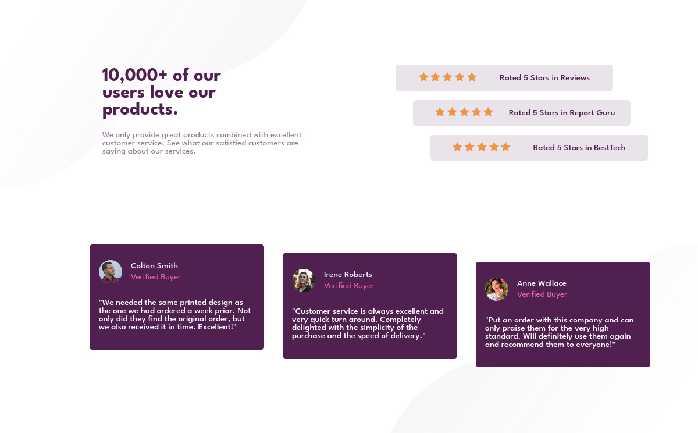

# Frontend Mentor - Social proof section solution

This is a solution to the [Social proof section challenge on Frontend Mentor](https://www.frontendmentor.io/challenges/social-proof-section-6e0qTv_bA). Frontend Mentor challenges help you improve your coding skills by building realistic projects. 

## Table of contents

- [Overview](#overview)
  - [The challenge](#the-challenge)
  - [Screenshot](#screenshot)
  - [Links](#links)
- [My process](#my-process)
  - [Built with](#built-with)
  - [What I learned](#what-i-learned)
  - [Continued development](#continued-development)
  - [Useful resources](#useful-resources)
- [Author](#author)
- [Acknowledgments](#acknowledgments)


## Overview

### The challenge

Users should be able to:

- View the optimal layout for the component depending on their device's screen size


### Screenshot




### Links

- Solution URL: [Solution](https://github.com/AlexdelCarmen/social-proof)
- Live Site URL: [Live site](https://alexdelcarmen.github.io/social-proof/)

## My process

Started off by laying out the HTML skeleton, then moved on to add mobile styles first, and lastly I finished with media queries to styale desktop layouts. 

### Built with

- Semantic HTML5 markup
- CSS custom properties
- Flexbox
- Mobile-first workflow
- CSS Grid

### What I learned

A nice chance to practice grid layouts. 


```css
@media (min-width: 800px) {
  .social-container {
    min-width: 800px;
    width: 75%;
    display: grid;
    grid-template-columns: repeat(2, 1fr);
    grid-template-rows: repeat(2, 1fr);
    background-image: url(./images/bg-pattern-top-desktop.svg), url(./images/bg-pattern-bottom-desktop.svg);
    background-size:33vmax, 33vmax;
  }
```


### Continued development

manipulating background images is still a tad challenging. 
### Useful resources

- [W3Schools article on multiple backgrounds on an HTML element](https://www.w3schools.com/css/css3_backgrounds.asp) - Consulted to refresh myself on handling multiple background images.


## Author

- Website - [Github Profile](https://github.com/AlexdelCarmen)
- Frontend Mentor - [@AlexdelCarmen](https://www.frontendmentor.io/profile/AlexdelCarmen)
- Twitter - [@AlekBorchov](https://twitter.com/AlekBorchov)

## Acknowledgments

To the kids.  
